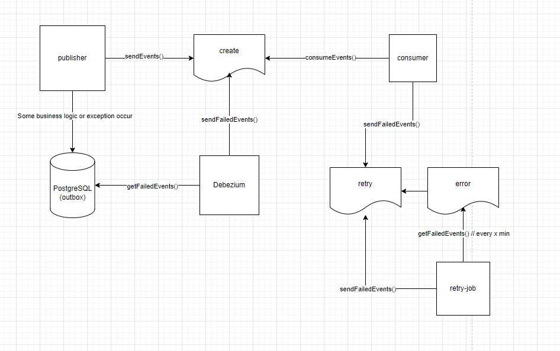
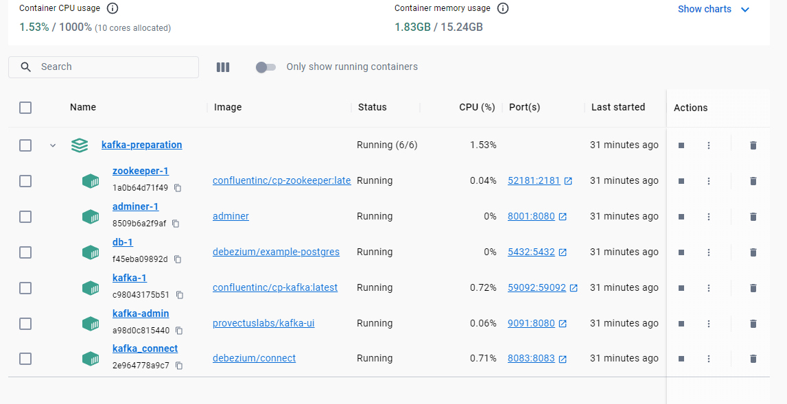

# Kafka PoC

The repository to store the Kafka PoC project.

## Diagram



## Build and Run

* In kafka-prepration root:

```shell
  docker compose up -d
```

After run docker compose command compare your containers with this:  


* Run respectively the apps

```
  kafka-publisher
  kafka-consumer
  kafka-retry-job 
```

## Warning:

- Kafka topics will be created with just 1 partition if you let the apps create those topics.
- Since we have only 1 broker we are restricted to increase replication factor more than 1

## Postman:

- Check under the resource folder `kafka.postman_collection.json` for sending event and create debezium
  connector.